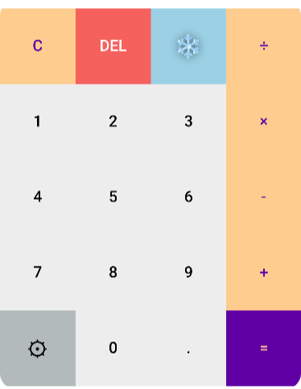

# Simple Calculator App

## Overview
The **Simple Calculator App** is a lightweight application developed using **Flutter** in January 2023. It allows users to perform basic arithmetic operations through a clean and intuitive interface.

## Features
- Addition, subtraction, multiplication, and division operations
- ~~Responsive design compatible with various device sizes~~
- Efficient performance with minimal resource usage

## Technologies Used
- **Flutter**: A UI toolkit for building natively compiled applications across mobile, web, and desktop from a single codebase.

## Requirements
- **Flutter SDK**: [Installation Guide](https://flutter.dev/docs/get-started/install)
- Compatible IDE (e.g., Visual Studio Code, Android Studio)
- Emulator or physical device for testing

## Installation
1. Clone the repository:
   ```bash
   git clone https://github.com/AZaUk2/FlutterCalculator.git
   ```
2. Navigate to the project directory:
   ```bash
   cd FlutterCalculator
   ```
3. Fetch the dependencies:
   ```bash
   flutter pub get
   ```
4. Run the application:
   ```bash
    flutter run
   ```

## Usage
Launch the app on your chosen device or emulator.
Utilize the calculator interface to execute arithmetic operations.

## Screenshots

### Default looking UI:

### Dark mode UI:

### Light mode UI:

### Different designs of buttons:




## Contributing

### Contributions are welcome! To contribute:

1. Fork the repository. 
2. Create a new branch:
   ```bash
   git checkout -b feature-branch-name
   ```

3. Commit your changes:
   ```bash
   git commit -m "Description of changes"
   ```
4. Push to the branch:
   ```bash
    git push origin feature-branch-name
   ```
5. Open a pull request.

## License

This project is licensed under the Mozilla Public License 2.0.